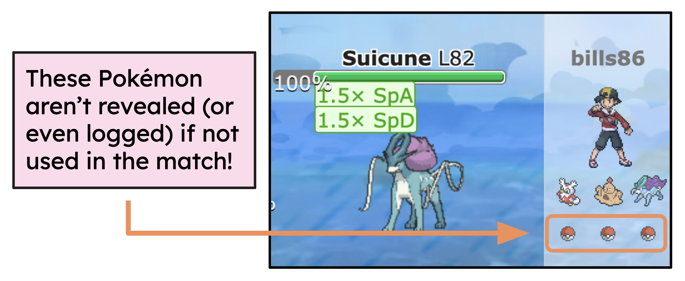

# Assessing "Balance" in Random Pokémon Battles

<u>Contributors:</u> Taylor Daniels, Xiaoyu Huang, Greg Knapp, Mohammed Mannan, Marz Newman 

**[Project Summary](./documentation/ExecutiveSummary.pdf)** | **[Presentation Slides](./documentation/PokemonBattlePredictorSlides.pdf)**

------------------------------------------------------------
## Overview

#### Directory Structure
```
summer26-pokemon-battle-predictor/
├─ data/
│  └─ replays/
├─ docs/ # extra documentation and write-ups
├─ modeling/
├─ misc/
├─ parallel_computation/ # for computing "advantage" at-scale.
└─ tools/ 
```

#### Models and Results: 
See [Final_EDA_Summary.ipynb](modeling/Final_EDA_Summary.ipynb) and [Final_Modeling_Summary.ipynb](modeling/Final_Modeling_Summary.ipynb).

### Table of Contents
1. [Summary](#summary)
2. [Data Collection and Processing](#data-collection-and-processing)
3. [Feature Engineering](#feature-engineering)
4. [Model Selection](#model-selection)
5. [Conclusions](#conclusions)

------------------------------------------------------------
### Summary
If you had to build two teams of Pokémon to battle, how do you give both teams a fair chance? 
With over 1,000 Pokémon to choose from, each with types, abilities, move-sets, and 
individual stats, the number of possible teams is astronomical. What if you had to do this *randomly*? 
Moreover, if you played in such a game, how might you assess your initial chances of winning?

In [Pokémon Showdown](http://play.pokemonshowdown.com) (“Showdown”) *Gen-9 Random Battles*, players have to do just that&mdash;
compete with teams of six randomly selected Pokémon. This is by-far Showdown's most popular game format, and the developers
aim to balance these randomly generated teams so that, on average, both players have nearly equal chances of winning.

From the Showdown developers’ perspective, there are a number of factors and methods to consider in designing this balanced gameplay. 
We aim to investigate whether or not the team generation procedure is balanced. 

------------------------------------------------------------
### Data Collection and Processing

Our models were trained and tested on cleaned battle logs for about 18,000 random battles sourced from Showdown's replay database. 
Our process for collecting, parsing, and cleaning these battle logs is detailed in [DataProcessingNotes](./documentation/DataProcessingNotes.md).



One notable difficulty in this cleaning was the following: in each random battle, players' Pokémon are neither visible (nor even logged) until they are individually fielded.
Our method for interfacing with Showdown's source code in order to re-generate the complete team rosters in each battle is outlined in [GettingFullTeams.md](./tools/GettingFullTeams.md).

------------------------------------------------------------
### Feature Engineering

There are a large number of potential features to consider in modeling teams of six Pokémon. 
In addition to Pokémon's *base stats* (HP, Attack, Defense, etc.) and players’ *Elo ratings* (See either [Ratings](./documentation/Ratings.md) 
or [Wikipedia](https://en.wikipedia.org/wiki/Elo_rating_system) for details), our models also incorporate:
    <ul>
        <li><strong>Type Diversity&hairsp;:</strong> The number of unique Pokémon types on a team;</li>
        <li><strong>Pokémon <i>Advantage</i>&hairsp;:</strong> A custom statistic approximating the expected difference in total damage that two opposing Pokémon would exchange in a one-on-one 
match; see [AdvantageStat](./documentation/AdvantageStat.md) for details.</li>
        <li><strong>Team Advantage&hairsp;:</strong> The cumulative sum of the Advantages for all 36 possible pairs of opposing Pokémon from each team.</li>
    </ul>
    While Team Advantage was our most impactful feature, it has known drawbacks, such as failing to consider the specific moves or abilities for each Pokémon. In an attempt to address this we 
introduced the <i>Stat-Booster Differential</i>, which records the difference in the number of Pokémon on each team that have stat-boosting moves or abilities.

------------------------------------------------------------
### Model Selection

For a “baseline” model, it was sensible to use a single-feature predictor based on players’ Elo rating differences, as the Elo system maps this difference to estimated probabilities of each player winning.
In addition, we considered Logistic Regression models both with and without intercept terms (the "biased" and "unbiased" models, respectively), the standard Decision Tree and Random Forest models, 
and the "boosted" models HGBoost and XGBoost.

We trained our models on the features which optimized their cross-validation accuracy: for the unbiased logistic regression, these were Elo differential, team advantage, and stat-booster 
differential. 
The remaining models trained on all of those features, plus the type-diversity and total-stat differentials.

Accuracy was chosen over other metrics for its ease of interpretation and because our application does not require precautions against false positives and negatives 
(as one might have in, e.g., medical diagnoses). 
Additionally, we wanted to select a model that was <i>well-calibrated</i>&hairsp;: since Player 1 lost in 52% of the matches, we wanted a model which would predict that Player 1 would lose approximately 52% of the time.

On our training data, the baseline- and unbiased Logistic Regression models were 52.1% and 53.1% accurate, and both were well-calibrated. The remaining models had accuracies all close to the former two, but were poorly calibrated, leading us to select the unbiased logistic regression as our final model.

------------------------------------------------------------
### Conclusions

After testing several supervised learning models, including Logistic Regression, Random Forest, and XGBoost, on our dataset of battle replays, an unbiased Logistic Regression model was our model 
of choice. After training on data from about 13,000 random battles, said model only achieved a test-data accuracy of 53.6%. 
As this is not much better than a coin flip's accuracy of 50%, we conclude that the level and move-set scaling performed by Pokémon Showdown for Gen-9 random battles is sufficiently balanced to maintain interesting and unpredictable gameplay.

------------------------------------------------------------
> [!NOTE]
> This project work was part of the Erdős Institute's Summer 2026 Data Science Boot Camp.